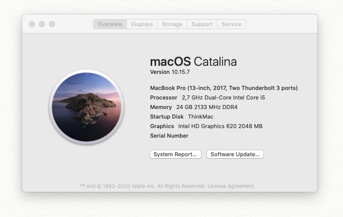

# Lenovo ThinkPad L470 ( 20J5S2M800 ) Hackintosh

DISCLAIMER: Read the entire README before you start. I am not responsible for any damages you may cause.

Goal of this repo is to run Hackintosh on Lenovo ThinkPad L470 (20J5S2M800) Laptop using OpenCore.

**Status: Work In Progress**
| MacOS (Currently Catalina `10.15.7` ) working on ThinkPad L470 |
| :-----------------------------------------: |
|  |

## OpenCore Installation Guide

Go to [INSTALLATION_GUIDE_OPENCORE.md](INSTALLATION_GUIDE_OPENCORE.md)(**Detailed guide**)

## About this Laptop

### Original Hardware Info 💻

| Type              | Spec                                                                  | Status      | Link                                                                                                     |
| :---------------- | :-------------------------------------------------------------------- | :---------- | :------------------------------------------------------------------------------------------------------- |
| Computer          | Lenovo ThinkPad L470 (20J5S2M800)                                     | Working     | -                                                                                                        |
| UEFI BIOS Version | LENOVO ROGET74W (1.74 / 2020-06-05)                                   | Working     | -                                                                                                        |
| CPU               | Intel(R) Core(TM) i5-7200U CPU @ 2.50GHz                              | Working     | -                                                                                                        |
| Chipset           | Intel Sunrise Point-LP, Intel Kaby Lake                               | Working     | -                                                                                                        |
| Graphics          | Intel HD Graphics 620                                                 | Working     | [Guide](https://www.tonymacx86.com/threads/guide-intel-framebuffer-patching-using-whatevergreen.256490/) |
| Audio             | Realtek ALC298, Codec ID:10EC0298, Layout ID : 22                     | Working     | [Guide](https://github.com/acidanthera/AppleALC/wiki/Installation-and-usage)                             |
| Ethernet          | Intel(R) Ethernet Connection (4) I219-V                               | Working     | -                                                                                                        |
| WiFi              | Intel(R) Dual Band Wireless-AC 8265                                   | Not Working | -                                                                                                        |
| Bluetooth         | Intel(R) Bluetooth 8625 4.1                                           | Working     | -                                                                                                        |
| Touchpad          | Synaptics PS2 LEN2044                                                 | Working     | [Guide](https://github.com/RehabMan/OS-X-Voodoo-PS2-Controller)                                          |
| Keyboard          | PS2 Keyboard LEN0071                                                  | Working     | [Guide](https://github.com/RehabMan/OS-X-Voodoo-PS2-Controller)                                          |
| Webcam            |                                                                       | Working     | -                                                                                                        |
| Card Reader       | Realtek RTS522A PCI Express Card Reader                               | Working     | [Guide](https://github.com/cholonam/Sinetek-rtsx/releases)                                               |
| Battery           | Serial Number: L16M2PB2- 1229 Manufacturer: SMP Device Name: L16M2PB2 | Working     | [Guide](https://www.tonymacx86.com/threads/guide-how-to-patch-dsdt-for-working-battery-status.116102/)   |

### Software Status 👨‍💻

| Type                                                                 | Spec | Status  |
| :------------------------------------------------------------------- | :--- | :------ |
| Battery Status                                                       | -    | Working |
| Brightness With keys(F5 - F6) change shortcut in System > Preference | -    | Working |
| Sleep                                                                | -    | Working |

### Kext Used

| Kext                                                                                                          | Info                                                                                                                          |
| :------------------------------------------------------------------------------------------------------------ | :---------------------------------------------------------------------------------------------------------------------------- |
| [Lilu.kext](https://github.com/acidanthera/Lilu)                                                              | Arbitrary kext and process patching on macOS.                                                                                 |
| [AppleALC.kext](https://github.com/acidanthera/AppleALC)                                                      | For Audio.                                                                                                                    |
| [CPUFriend.kext](https://github.com/acidanthera/CPUFriend)                                                    | Dynamic macOS CPU power management data injection                                                                             |
| [VirtualSMC.kext](https://github.com/acidanthera/VirtualSMC)                                                  | SMC Emulator Layer.                                                                                                           |
| [SMCBatteryManager.kext](https://github.com/acidanthera/VirtualSMC)                                           | Battery Status Monitoring.                                                                                                    |
| [SMCProcessor.kext](https://github.com/acidanthera/VirtualSMC)                                                | Processor Temp Monitoring.                                                                                                    |
| [SMCSuperIO.kext](https://github.com/acidanthera/VirtualSMC)                                                  | Fan Reading.                                                                                                                  |
| [USBPorts.kext](https://www.tonymacx86.com/threads/the-new-beginners-guide-to-usb-port-configuration.286553/) | For USB Port mapping.                                                                                                         |
| [VoodooPS2Controller.kext](https://github.com/RehabMan/OS-X-Voodoo-PS2-Controller)                            | Contains updated Voodoo PS/2 Controller, improved Keyboard & Synaptics TouchPad.                                              |
| [WhateverGreen.kext](https://github.com/acidanthera/WhateverGreen)                                            | Various patches necessary for certain ATI/AMD/Intel/Nvidia GPUs. This is needed for Intel HD 520.                             |
| [VoodooTSCSync.kext](https://github.com/RehabMan/VoodooTSCSync)                                               | A kernel extension which will synchronize the TSC on any Intel CPUs. Without this system hangs/freeze after awake from sleep. |
| [IntelMausi.kext](https://github.com/acidanthera/IntelMausi)                                                  | Intel Ethernet LAN driver for macOS.                                                                                          |
| [IntelBluetoothFirmware.kext](https://github.com/OpenIntelWireless/IntelBluetoothFirmware)                    | Intel Bluetooth Drivers for macOS                                                                                             |
| [SmallTreeIntel82576.kext](https://github.com/khronokernel/SmallTree-I211-AT-patch)                           | Patched SmallTree kext for I211-AT support                                                                                    |
| [NoTouchID.kext](https://github.com/al3xtjames/NoTouchID)                                                     | Lilu plugin for disabling Touch ID support                                                                                    |
| [USBInjectAll.kext](https://github.com/RehabMan/OS-X-USB-Inject-All)                                          | Kext to inject all USB ports for the installed Intel EHCI/XHCI chipset automatically.                                         |

### DSDT / SSDT Used

| DSDT / SSDT | Info                                                                                       | Refrence Link                                         |
| :---------- | :----------------------------------------------------------------------------------------- | :---------------------------------------------------- |
| DSDT.aml    | Patching LAPTOP DSDT (Include Enable Backlight Control & Battery Status Patch by RehabMan) | [Link](https://github.com/RehabMan/Laptop-DSDT-Patch) |

### TODO

- Keyboard Fn
- USB mapping tutorial.
- Separate guide for battery, backlight etc.
- Suggest to me via issue.

### Telegram Channel

- [H4CK1NTOSH L0V3R / Indonesia Hackintosh Lover Telegram Group ](https://t.me/HackintoshLover)

### Credits

- [Apple](https://www.apple.com) Thank you for making a beautiful OS.
- [Dortania](https://dortania.github.io/OpenCore-Install-Guide/) Thanks to Dortania and the team behind it who made this possible. I highly recommended you read the guide on the Dortania page. It is boring but very important.
- [Acidanthera](https://github.com/acidanthera) for most of the kexts.
- [RehabMan](https://github.com/RehabMan) for some patches.
- [www.elitemacx86.com](https://www.elitemacx86.com) thanks for all the articles which are very helpful.
- [www.olarila.comy](https://www.olarila.com) thanks for all the articles which are very helpful.
- And anyone else that helped to develop and improve hackintoshing.
- me
